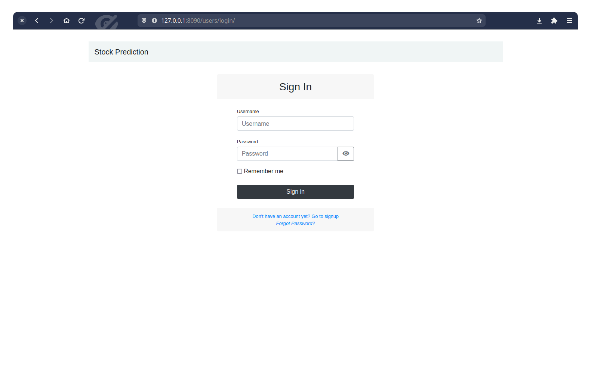
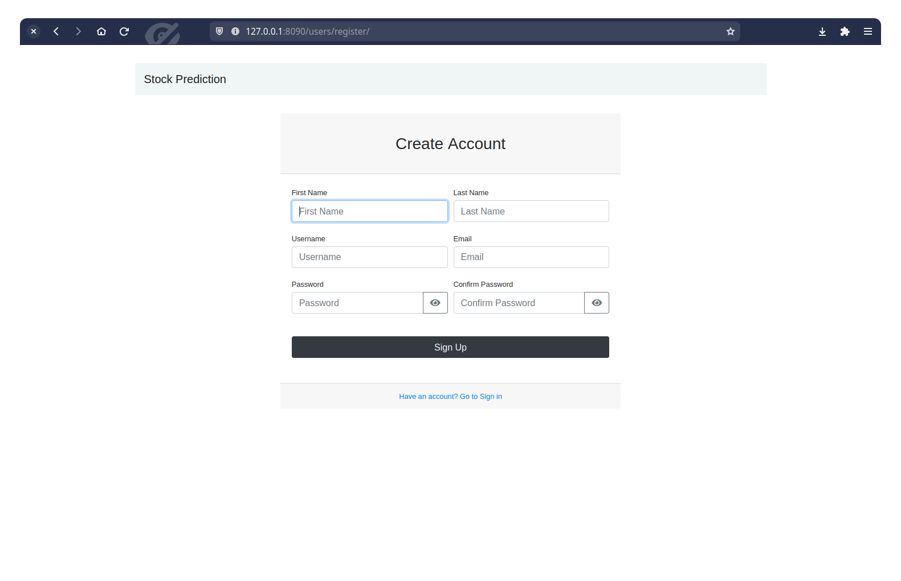
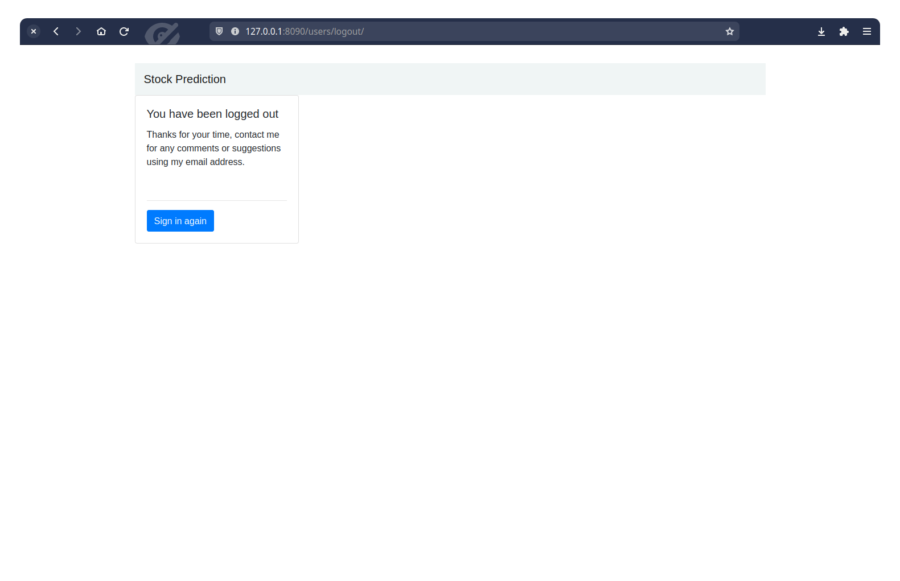
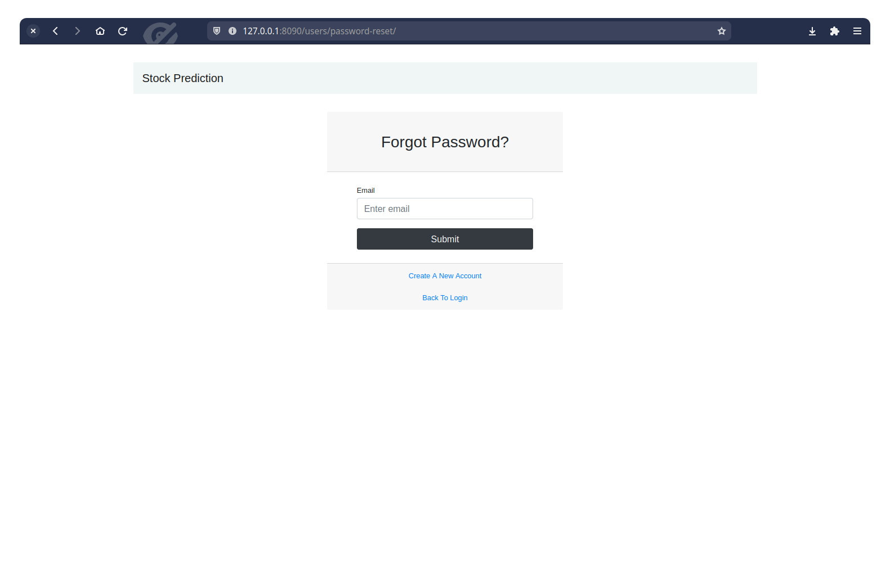
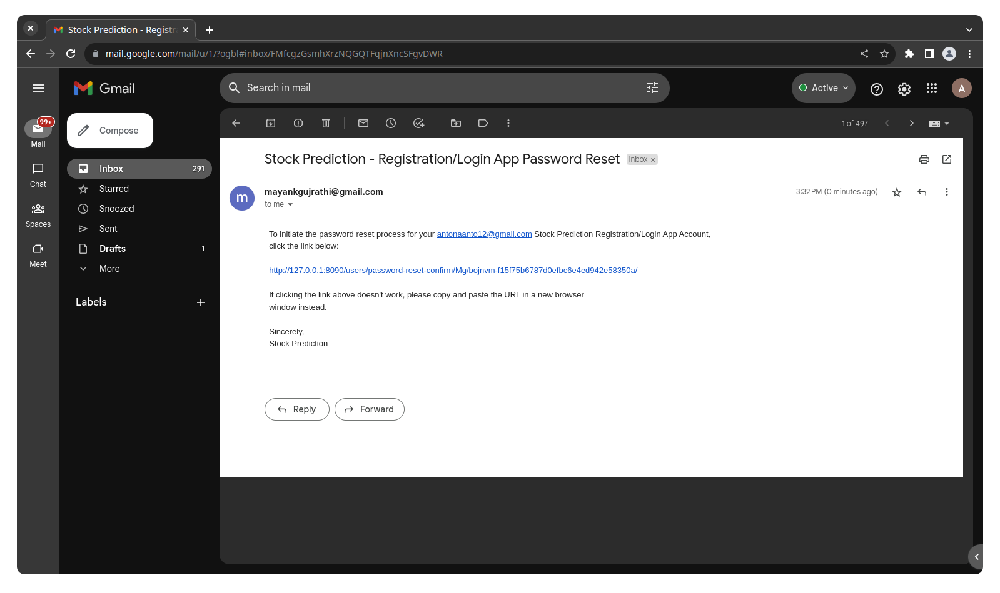
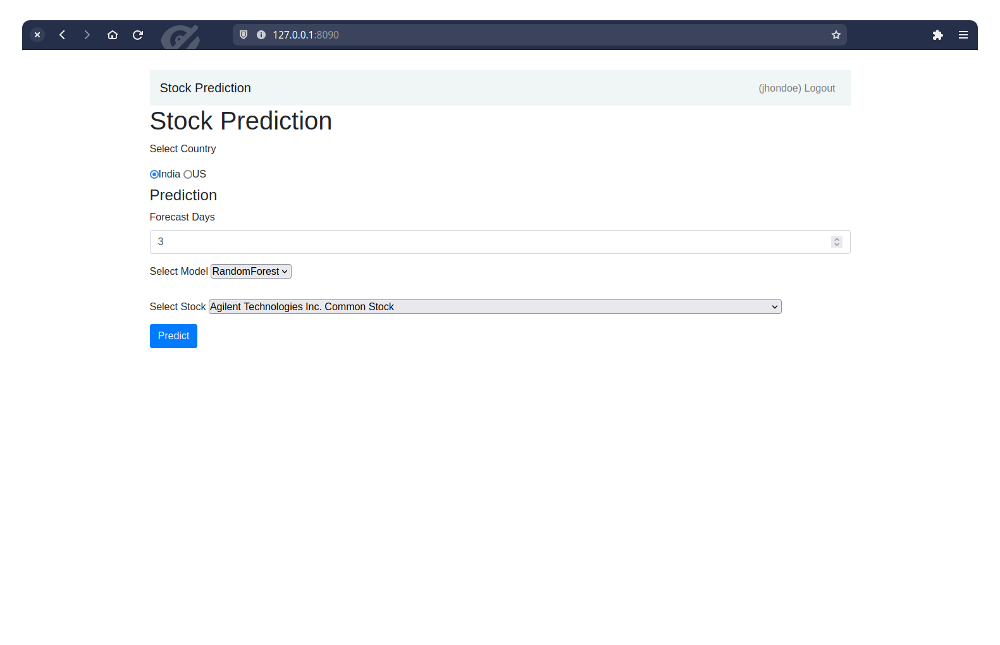
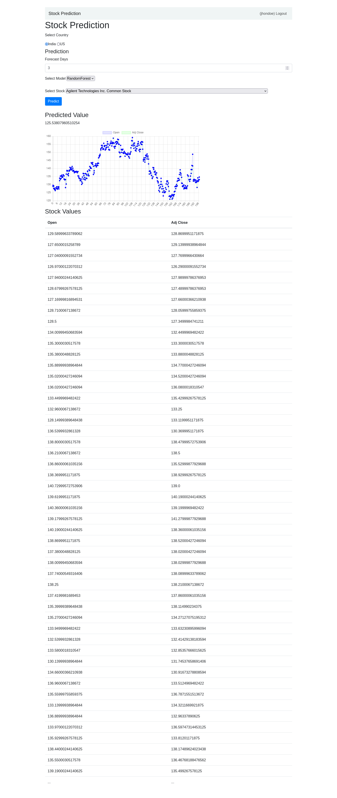
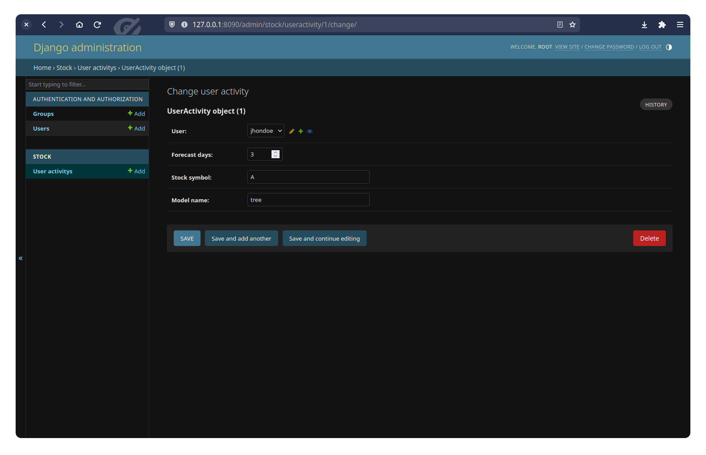

# Stock Prediction
A Simple DJango Application which is capable of adding new users and help them predict stocks (Data from Yahoo Finance)

## Algorithms
Algorithms used for Stock Prediction are

1. Support Vector Machine Regressor
2. Random Forest Regressor

## Working Screenshorts
### Login Page

### Signin Page

### Logout Page

### Forget Password Page

### Password Reset Email

### Home Page

### Prediction Page

### Stored User Activity in Database

